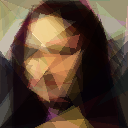
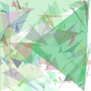

# Algoritmo Genetico para Aproximacao de Imagens

Este projeto implementa um algoritmo genetico que tenta aproximar uma imagem-alvo usando triangulos transparentes sobrepostos.

Cada individuo da populacao representa uma imagem candidata. Em vez de armazenar pixels diretamente, o individuo armazena um vetor de triangulos. Cada triangulo possui coordenadas, cor RGB, transparencia e uma posicao no vetor, que define sua camada de renderizacao.

## Exemplo de Resultado

Melhor individuo obtido usando a imagem da Mona Lisa como alvo:



Exemplo de evolucao usando a logo do Batman:



## Como Funciona

O algoritmo segue estas etapas:

1. Cria uma populacao inicial aleatoria.
2. Renderiza cada individuo como uma imagem.
3. Calcula o fitness comparando a imagem gerada com a imagem-alvo.
4. Seleciona individuos por torneio.
5. Gera filhos por crossover uniforme.
6. Aplica mutacoes nos triangulos.
7. Mantem o filho apenas se ele for melhor que o pai.
8. Repete o processo por varias geracoes.

O fitness usado e a media das diferencas absolutas entre os pixels RGB da imagem gerada e da imagem-alvo. Quanto menor o fitness, melhor o resultado.

## Instalação

Crie e ative um ambiente virtual:

```bash
python -m venv .venv
source .venv/bin/activate
```

Instale as dependencias:

```bash
pip install -r requirements.txt
```

## Execução

Coloque a imagem-alvo em:

```text
assets/alvo/alvo.png
```

Depois execute:

```bash
python main.py
```

Ao final da execução, o programa salva:

```text
assets/resultados/melhor_individuo.png
assets/resultados/evolucao.gif
```

## Estrutura

```text
main.py
src/
  config.py
  individuo.py
  populacao.py
  renderizacao.py
  fitness.py
  selecao.py
  crossover.py
  mutacao.py
  genetico.py
assets/
  alvo/
  resultados/
```

## Principais Parametros

Os principais parametros ficam em `src/config.py`:

```python
IMAGE_WIDTH
IMAGE_HEIGHT
POPULATION_SIZE
NUM_TRIANGLES
TOURNAMENT_SIZE
NUM_GENERATIONS
MUTATION_RATE
DELTA_COORDENADA
DELTA_COR
DELTA_ALPHA
ALPHA_MIN
ALPHA_MAX
```

Esses valores controlam o tamanho da imagem, o tamanho da populacao, a quantidade de triangulos, a intensidade das mutacoes e o numero de geracoes.
